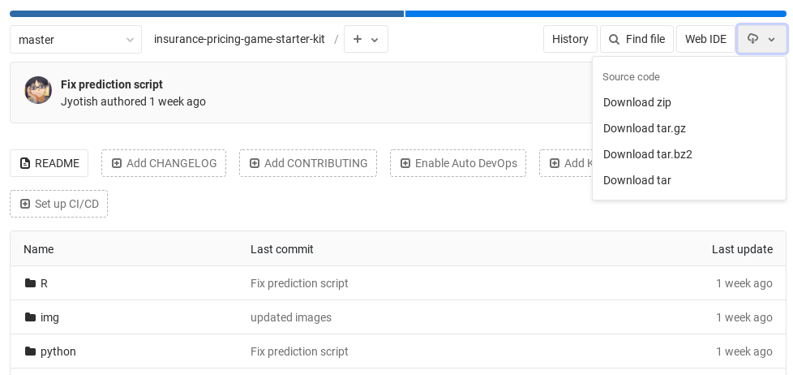

# Insurance Pricing Game


This is the starter kit for the [Insurance Pricing Game](https://www.aicrowd.com/challenges/insurance-pricing-game) hosted on [AIcrowd](https://www.aicrowd.com). This file explains how to get started, and how to submit to the competition.

Join the community for exciting discussions! [](https://discord.gg/em7aNkt)

# Table of contents

- [💪 Getting Started](#-getting-started)
  - [Using Python](#using-python)
  - [Using R](#using-r)
  - [Download this starter-kit](#download-the-starter-kit)
- [🔧 Preparing your submission](#-preparing-your-submission)
  - [Train your model](#train-your-model)
  - [Produce predictions](#produce-predictions)
- [🧩 Repository structure](#-repository-structure)
  - [Model template code](#model-template-code)
  - [Remaining files in repository](#remaining-files-in-repository)
- [📨 Submission](#-submission)
  - [Prepare your Python environment](#prepare-your-python-environment)
  - [Prepare your R environment](#prepare-your-r-environment)
  - [Optional customisation](#optional-customisation)
  - [Submitting to AIcrowd](#submitting-to-aicrowd)
  - [After you submit](#after-you-submit)
- [📝 Submission checklist](#-submission-checklist)

# 💪 Getting Started

Before you start, note that there are two methods for submitting to AICrowd. If you wish to submit using a notebook environment and not a `.zip` file, please go back to the [challenge page](https://www.aicrowd.com/challenges/insurance-pricing-game#how-to%20submit). 

## Using Python

1. Download the starter-kit ([see how](#download-the-starter-kit))
2. Download the data ([here](https://www.aicrowd.com/challenges/insurance-pricing-game/dataset_files))
3. Navigate to the `Python` folder in the `.zip` file. 
4. Open the `model.py` file. 
5. Fill in the [template code](#model-template-code) in that file.
6. Modify the `requirements.txt` file for any imported packages you have used (see [here](#prepare-your-python-environment)).
7. Train your model (see [instructions](#train-your-model)).
8. [Produce predictions](#produce-predictions) to see your model works. 
9. Compress the `Python` folder into a `.zip` file (see [what to include](#submitting-to-aicrowd)). 
10. Visit the [challenge page](https://www.aicrowd.com/challenges/insurance-pricing-game) and submit!


## Using R

1. Download the starter-kit ([see how](#download-the-starter-kit))
2. Download the data ([here](https://www.aicrowd.com/challenges/insurance-pricing-game/dataset_files))
3. Navigate to the `R` folder in the `.zip` file. 
4. Open the `model.R` file. 
5. Fill in the [template code](#model-template-code) in that file.
6. Modify the `install.R` file for any imported packages you have used (see [here](#prepare-your-r-environment)).
7. Train your model (see [instructions](#train-your-model)).
8. [Produce predictions](#produce-predictions) to see your model works. 
9. Compress the `R` folder into a `.zip` file (see [what to include](#submitting-to-aicrowd)). 
10. Visit the [challenge page](https://www.aicrowd.com/challenges/insurance-pricing-game) and submit!


## Download the starter kit
Click the "cloud" button in the top right, then "Download as zip".



See the section [Repository structure](#-repository-structure) for more information on what the individual files are used for.


# 🔧 Preparing your submission


## Train your model

Once you have modified the `model.py`/`model.R` file to implement a model, you will need to train this model on data. To train your model on the training data provided in the repository, run the following command:

```bash
python train.py training.csv
```

```bash
Rscript train.R training.csv
```

This will use your code in `model.py`/`model.R` and, if there are no error messages, will create a file named `trained_model.pickle`/`trained_model.RData` in the folder. 

For `Python`, note that you can modify the `save_model` and `load_model` functions to work with something other than `pickle`.

## Produce predictions
To produces prices we've provided you with a `test.sh` (or `test.bat` for Windows users). These will generate two `csv` files:
1. `claims.csv` that is produced using your `predict_expected_claim` function.
1. `prices.csv` that is produced using your `predict_premium` function.

To run these files first make sure they are _executable_ files (look up how to run `.sh` files or `.bat` files for Windows users). Next you can run:

**On non-Windows**, open the terminal and type:
```bash
 ./test.sh
```

**On Windows**, double click on the `test.bat` file and that should run. You might have to run it as an administrator. 

**Note:** In these files you can change `training.csv` to another file to generate predictions on another dataset. 


# 🧩 Repository structure

There two types of files here:
1. **Model template code**. This is what you have to fill in first. 
2. **Other files**. See below. 

## Model template code
This code is stored in the `model.py`/`model.R` file. It defines four functions: 

**Function** | **Description**
--- | ---
`fit_model` | Train the model using the training data.
`predict_expected_claim` | Estimate the expected claims of new data.
`predict_premium` | Output a price for new contracts. This could be the expected claim or include whatever new pricing strategy.
`save_model` | Save a trained model to file.
`load_model` | Load a trained model from file.

You are only expected to modify the first three functions. Comments in the code provide more details on the expected inputs/outputs of the functions.

## Remaining files in repository

**File** | **Description**
--- | ---
`train.py`/`.R` | The training script. This uses `fit_model` to train your model on the data, then saves it using `save_model`. You can modify this script, but you don't need to.
`predict.py`/`.R` | The script to generate prices from a trained version of your model (loaded with `load_model`) using the `predict` functions. Do _not_ modify this script.
`test.sh`/`.bat` | The script that uses your trained model and generates two CSVs using the functions within your model. See how to [produce predictions](#produce-predictions) for more details
`config.json` | A configuration file that tells AICrowd whether you are using R or Python.).
`requirements.txt` / `install.R` | These files include the packages that you wish to install. See below for R or Python specific installation. 


# 📨 Submission

## Prepare your Python environment
In order to run your code on the AICrowd server, you will need to list _all_ the packages that need to be installed by us. The best way to do this is to modify the package list in `requirements.txt`. 

Currently this file includes a list of default packages. If you only use packages on this list, you don't need to change anything. 

## Prepare your R environment
In order to run your code on the AICrowd server, you will need to list _all_ the packages that need to be installed by us. 

To do this, please fill in the `install.R` script following the examples provided. 

## Optional customisation
Beyond packages, if you wish to use alternative ways to include your packages or to include `apt` packages, or a `Dockerfile` you are free to do so, entirely optionally. Here are other supported options:

**File** | **Description**
--- | ---
`apt.txt` | We will install the packages from this file before conda/pip installations.
`environment.yml` | We will use `conda` to install the packages in your environment from this file. If you are using `conda` locally, you can export your environment using `conda env export --name <env_name> > environment.yml`
`Dockerfile` | We will build the docker image using this file. **If you have a Dockerfile in your repository, any other automatic installation will not be triggered**. This means that you will have to include installation steps for `apt.txt`, `requirements.txt`, and `environment.yml` yourself.


## Submitting to AIcrowd

Once you are happy with your code (and you have checked it works), submit it!  Submissions on AICrowd will run your code on the (secret) testing data.

To submit to AICrowd, you will need to compress a folder including:
1. Your model code: `model.R` or `model.py`.
2. Your trained model: `trained_model.pickle`/`trained_model.RData` (you may use something other than `pickle`)
3. The configuration file: `config.json`.
4. The file describing your packages: `requirements.txt`/`install.R` (or other), with **all the packages you use listed**.
5. Other files in the folder: `train.py`/`train.R`, `predict.py`/`predict.R`.
6. (Optional) All other codes files that are needed to run your code (e.g., custom modules).

Now that you have compressed your file in one zip file, go to [the challenge page](https://www.aicrowd.com/challenges/insurance-pricing-game), and send it with the "Create Submission" button:


### After you submit

Once you submit your zip file, the server extracts the files from the archive, creates the environment with the correct packages, then runs your code on testing data. **If an error occurs and prices can't be generated**, you will receive an error. **If all goes fine**, congratulations! The RMSE leaderboard will be updated immediately with your score. The profit leaderboard will be updated at the end of the week with your latest submission.

If you have any questions, don't hesitate to [reach out on the forums](https://www.aicrowd.com/challenges/insurance-pricing-game/discussion), or directly at:

- Ali Farzanehfar: [`ali.farzanehfar@imperial.ac.uk`](mailto:ali.farzanehfar@imperial.ac.uk)
- Florimond Houssiau: [`florimond@imperial.ac.uk`](mailto:florimond@imperial.ac.uk)


# 📝 Submission checklist

Here are a few tips for you to make sure your submission will run properly:

- [x] **Filled out `model.py`/`model.R`.** Make sure that the `predict_...` functions in your `model.py`/`model.R` file do **not re-train your model**.
- [x] **Trained your model.** Before you train a model, remove the `trained_model.pickle`/`trained_model.RData` file. This will make sure you don't have incompatibilities between `model.py`/`model.R` and your trained model.
- [x] **Tested your predictions.** Your `predict_expected_claim` should aim at predicting the expected cost of a contract (probability of claim times expected cost of that claim) as accurately as possible, as it is used in the RMSE leaderboard. The expected cost of a contract is then typically used to price it, in your `predict_premium` function. This function is used to generate the prices that contracts will compete for in the average profit leaderboard, so feel free to use your own pricing strategy.
- [x] **Included packages required.** When you add a new package to your model, add it to `requirements.txt`/`install.R` to make sure that AICrowd is able to run your code. See [here](#-submission) for more details.
- [x] **Included correct model saving/loading functionality.** If you modify `save_model`, do not forget to modify accordingly the `load_model` function.
- [x] **Created a zip file.** Ready? Compress all the relevant files in one zip file, then upload your submission to the server -- see [Submitting to AIcrowd](#submitting-to-aicrowd) for more details.
